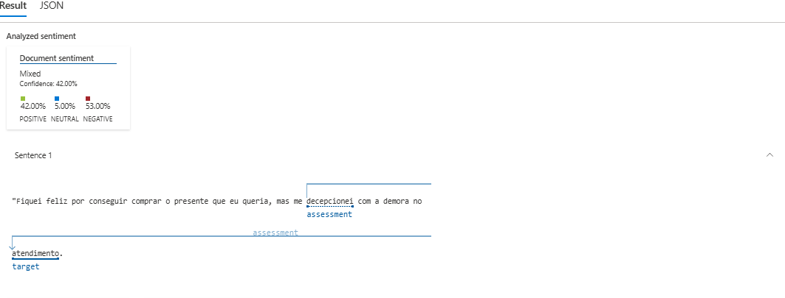
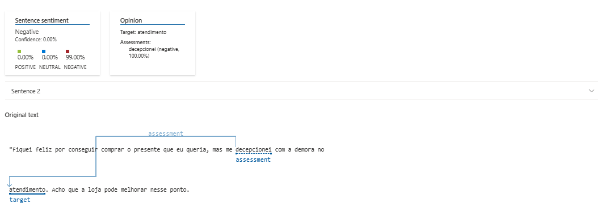

# Análise de Sentimentos com Language Studio no Azure AI

## Desafio DIO, bootcamp Randstad - Análise de Dados
 
 ---

**🇧🇷 Português:**

> Projeto prático utilizando Azure Language para analisar sentimentos em textos e explorar recursos de IA em linguagem natural. Inclui documentação técnica, testes realizados e exemplos aplicados.

---

**🇺🇸 English:**

> Practical project using Azure Language to analyze sentiment in texts and explore AI features for natural language. Includes technical documentation, tests performed, and applied examples.

---

#### - Frase analisada: "Fiquei feliz por conseguir comprar o presente que eu queria, mas me decepcionei com a demora no atendimento. Acho que a loja pode melhorar nesse ponto."

